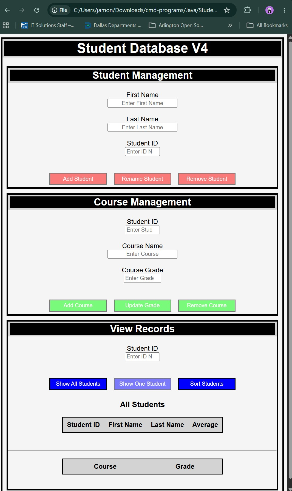
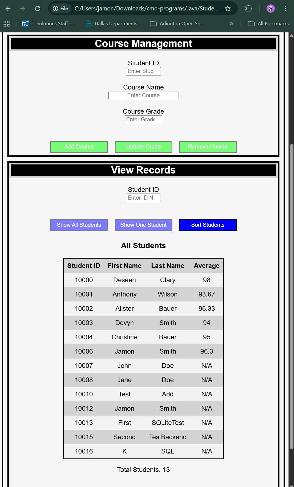
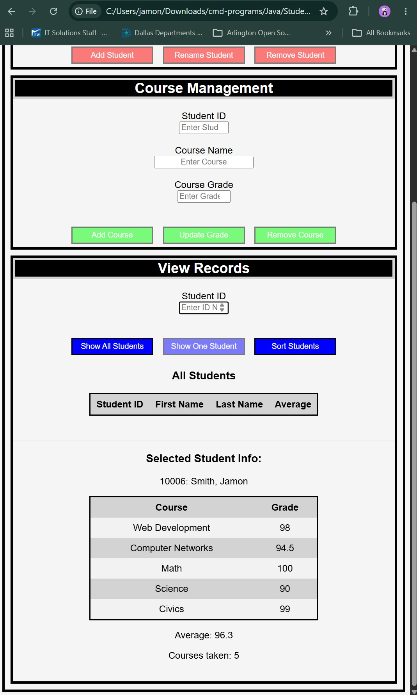

# StudentDatabaseSQL

A full-stack student records management application built with Java, SQLite, HTML, CSS,
and JavaScript. This Version extends my previous Student Database project by introducinga REST-style Java backend that communicates with a dynamic web-based frontend using the 
Fetch API. Student and course data are stored in an SQLite relational database and 
accessed through JDBC.

### Homepage (No Database Connection)

## Features

### Student Management
- Display all students in the database
- Display an individual student's transcript including enrolled courses and overall
  average.
- Add new students.
- Rename existing students (supports updating first name, last name or both).
- Remove a student and all their information.

### Course Management
- Add courses existing student.
- Support courses with or without assigned grades.
- Update existing course grades.
- Remove courses from a student's transcript.

### Records and UI
- Sort students by ID number, first name, last name, or average grade.
- Confirmation prompts for destructive operations.
- Automatic synchronization between the frontend and SQLite database.
- Client-side and server side input validation.
- HTTP status codes and JSON responses for API communciation.

## Technologies

- Java 21.0.11
- Java HTTP Server (com.sun.net.httpserver)
- JavaScript (ES6)
- SQLite 3.53.2.0
- SQLite JDBC Driver (Xerial)
- HTML5
- CSS
- Gson
- Git/GitHub

## Backend Technology

- REST-style API endpoints
- JSON serialization and deserialization
- HTTP request routing
- Request validation
- CORS configuration
- CRUD operations
- Helper methods for request and response procressing

## SQL Skills Demonstrated

- SELECT
- INSERT
- DELETE
- UPDATE
- INNER JOIN
- LEFT JOIN
- GROUP BY
- Aggregate functions (AVG, COUNT, MIN, MAX)
- Prepared Statements
- Parameterized Queries
- Relational Database Design

## SOftware Engineering Skills Demonstrated

- Object-Oriented Programming
- SQLite Relational Database Design
- SQL Query Development
- JDBC Database Connectivity
- CRUD Operations
- Exception Handling
- Input Validation
- Console-Based Application Development
- Refactoring and Code Reuse
- Defensive Programming
- Version Control using Git
- JSON Processing
- REST API Design
- Full-Stack Web Design and Development

## Project Evolution

Version 1
- In-memory student management using Java Collections.

Version 2
- Persistent storase using text files and file I/O.

Version 3
- SQLite relational database with JDBC connectivity and SQL queries.

Version 4 
- Complete migration to full stack web application.
- Java REST-style backend using HttpServer.
- JavaScript frontend using Fetch API.
- JSON communication using GSON.
- SQLite-backend CRUD operations for students and courses.
- Dynamic frontend synchronized with the backend database.
- Improved validation, error handling, and HTTP status codes.

## Future Improvements

- Implement resource-based endpoints.
- Replace manual JSON construction with full GSON serialization.
- Refactor shared handler functionality into reuseable utility classes.
- Improve API responses with more descriptive results.
- Add authentication and user accounts.
- Containerize application with Docker.
- Deploy application to a cloud hosting platform.

## More Project Screenshots

### View Records Section (With Database Connection, All Students)

### View Records Section (With Database Connection, One Students)

### SQLite Students Table

### SQLite Grades Table

### Backend Data in JSON Form

